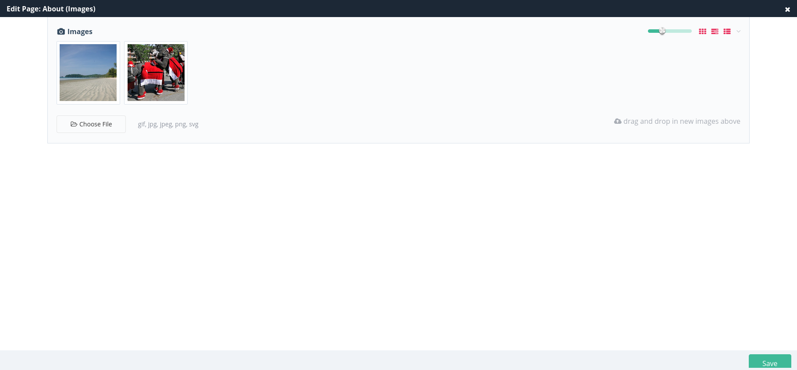

# FieldtypeImagePicker & InputfieldImagePicker

**Fieldtype Image Picker** is a Fieldtype that stores a reference to a single image from another page and optionally its children, and/or from a folder and/or from the page that the field lives on. The image can be selected with the associated Inputfield.

**Inputfield Image Picker** is an Inputfield to select a single image from images on another page and optionally its children, and/or from a folder and/or from the page that the field lives on.


You can upload/edit images to other pages from within the input field


### When to use ?
If you want to let editors choose an image from a set of images that is being used site-wide. Ideal for images that are being re-used across the site (e.g. icons, but not limited to that).
Other than the native ProcessWire images field, the images here are not stored per page. Only references to images that live on other pages or inside a folder are stored. This has several advantages:
* one central place to organize images
* when images change, you only have to update them in one place. All references will be updated, too. (Provided the name of the image that has changed stays the same)

### Features
* Images can be loaded from a folder inside site/templates/
* Images can be loaded from other pages
* Images can be organized into categories. Child pages of the main 'image source page' serve as categories
* From the API side, images can be manipulated like native ProcessWire images (resizing, cropping etc.), even the images from a folder
* Image thumbnails are optionally loaded into inputfield by ajax on demand
* Image names are fully searchable through the API
```php
$pages->find('fieldname.filename=xyz.png');
$pages->find('fieldname.filename%=xy.png');
```
* Accidental image deletion is prevented. When you want to delete an image from one of the pages that hold your site-wide images, the module searches all pages that use that image. If any page contains a reference to the image you are trying to delete, deletion will be prevented. You will get an error message with links to help you edit those pages and remove references there before you can finally delete the image.
* This field type can be used with [marcrura's Settings Factory module](https://modules.processwire.com/modules/settings-factory/) to store images on settings pages, which was not possible with other image field types

### Settings / Options
* The page containing the images to choose from.
    - images from that page and optionally it's child pages will be used as site-wide images.
* The field name of the images field on that page.
* Option to include images from child pages of the page that contains images
* A folder containing the images to choose from
* Option to also include the images from the page that this field lives on
* Option to load thumbnails on demand via ajax. Especially useful when field is used inside repeaters or has many images
* Width of chosen image in Inputfield.
* Width of image thumbnails in Inputfield.


All settings are per field that you create from this fieldtype. This means you can have different images to choose from for different fields that you create.

### How to install and setup
1. [Download](https://github.com/gebeer/FieldtypeImagePicker/archive/master.zip) and install or [install from URL](https://github.com/gebeer/FieldtypeImagePicker/archive/master.zip) the module like any other modules in ProcessWire
2. Optional: create a page in the page tree that will hold your images and supply them to the inputfield. This page's template must have an images field
3. Optional: upload some images to the page you created in step 2
4. Optional: upload images to a folder inside site/templates
5. Create a new field. As type choose 'Image Picker'. Save the field.
6. Optional: in 'Details' Tab of the field choose the page you created in step 2
7. Optional: click Save button
8. Optional: choose the images field name for the field that holds your images (on page template from step 2)
9. Optional: click Save button again
10. Optional: upload images to a folder inside site/templates
11. Optional: choose to use that folder as image source
12. Optional: choose whether you want to include child pages of page from step 2 to supply images
13. Optional: choose whether you want to include images from the page the field lives on.
14. Optional: choose the images field name on the page that holds the images
15. Add the field to any template
16. You are now ready to use the field

### How to use in template files
```php
// render image 
fieldname->url ?>"> 
// all native ProcessWIre image manipulation methods (resizing, cropping etc.) are available
$thumb = $page->fieldname->width(100);
// render the text content for inlining SVG (works only with SVG images)
$page->fieldname->svgcontent
// search pages with image by file name or page id of the source page
$pages->find('fieldname.filename=xyz.png');
$pages->find('fieldname.pageid=1234');
```

### [ProcessWire forum thread](https://processwire.com/talk/topic/22665-module-imagepicker-pick-images-from-various-sources/)

### Credits
This module was developed based on ideas from forum members in [this forum thread](https://processwire.com/talk/topic/22732-fieldtypeimagefrompage-pick-an-image-from-various-sources/)

### Roadmap
* allow to chose multiple fields where source images are stored
* upload widget for images in folder